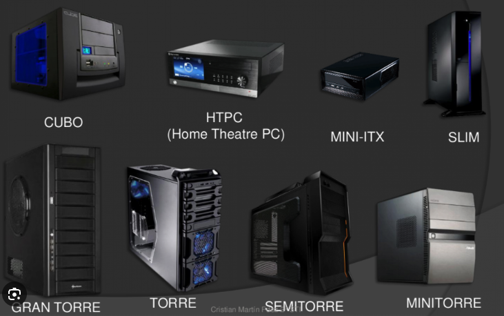
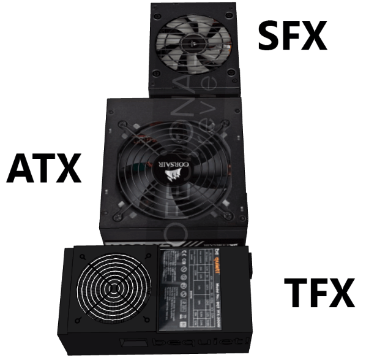
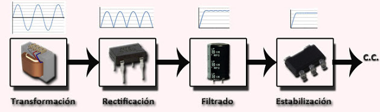
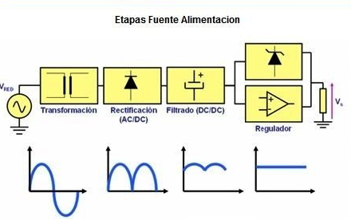
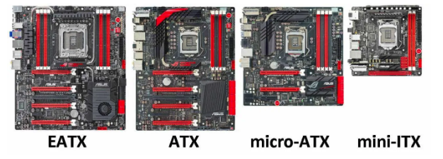

## SISTEMA BÁSICO DE UNA COMPUTADORA PERSONAL

- **Hardware**: Es la parte **fisica** de un ordenador o sistema informático. Esta formado por todos los componenetes **tangibles** que puedes ver y tocar como:
  - Placa base.
  - Procesador (CPU).
  - Memoria RAM.
  - Almacenamiento.
  - Tarjeta gráfica.
  - Fuente de alimentación.
  - Dispositivos de entrada.
  - Dispositivos de salida.
  - Periféricos.
  
- **Software**: El software, también conocido como **soporte lógico o logicial**, es el conjunto de **programas, datos y procedimientos** que permiten que un dispositivo electrónico funcione. A diferencia del **Hardware**, que son los componenetes físicos del dispositivo, el software es intangible y no se puede tocar.

- **Sistema operativo**: El sistema operativo es el software base que se ejecuta en un dispositivo informático, como una computadora, un teléfono inteligente o una tablet. Es el intermediario entre el hardware (Los componenetes físicos del dispositivo) y el **software de aplicación** (Los programas que usas para realizar tareas).

  - Administrar los recursos del hardware.
  - Proporcionar una interfaz de usuario.
  - Ejecutar y administrar programas.
  - Gestionar archivos y directorios.
  - Proporcionar servicios de red.
  - Proteger el sistema.

## Gabinete

El gabinete de PC juega un papel crucial en la protección, organización, enfriamiento, conectividad y estética de una computadora. Elegir el gabinete adecuado es importante para garantizar el óptimo funcionamiento y la longevidad de la pc.

- Proteccion.
  - Alojamiento y soporte.
  - Seguridad.
- Ventilación y enfriamiento.
  - Flujo de aire.
  - Ventiladores.
- Gestión de cables.
  - Organización.
  - Prevención de cortocircuitos.
- Conectividad y accesibilidad.
  - Puertos externos.
  - Bahías de unidades.
  - Acceso a componentes.
- Estetica.
  - Diseño.
  - Iluminación.

## Tipos de gabinetes



## Fuente de alimentación.

La fuente de alimentación (PSU) en un pc juega un papel fundamental, ya que es el componente encargado de **transformar la corriente alterna (CA)** que proviene del enchufe de pared en **corriente continua (CC)** que utilizan los componentes internos del ordenador para funcionar.

- Conversion de CA a CC.
- Suministro de energía.
- Protección.

## Tipos de fuentes de alimentación



### Fuente de alimentación SFX

- **Tamaño**: SXF es un afctor de forma mas pequeño que ATX, con dimensiones de 244mm x 170mm. Esto los hace ideales para gabinetes de pc compactos y mini-ITX.

- **Potencia**: Las fuentes de alimentación SFX generalmente ofrecen menor potencia que las ATX, con un rango típico de 300W a 650W. Sin embargo, hay opciones de alta potencia disponibles para configuraciones más flexibles.

- **Compatibilidad**: Las fuentes de alimentaciones SFX son compatibles con gabinetes SFX y algunos gabinetes ATX.

- **Caracteristicas**: Las fuentes de alimentación SFX pueden tener características similares a las ATX, como cables modulares y control de ventilador, pero debido a su tamaño compacto, el espacio disponible para estas funciones pueden ser limitado.

### Fuente de alimentación ATX

- **Tamaño**: Es el factor de forma más común para fuentes de alimentación, con dimensiones estándar de 305mm x 244mm.

- **Potencia**: Las fuentes de alimentación ATX ofrecen una amplia gama de opciones de potencia, desde 300W hasta 1200W o más, para satisfacer las necesidades de la mayoría de las configuraciones de PC.

- **Compatibilidad**: Las fuentes de alimentación ATX son compatibles con la mayoria de las cajas ATX y micro ATX.

- **Caracteristicas**: Las fuentes de alimentación ATX suelen tener una variedad de características, como cables modulares, control de ventilador y certificaciones de eficiencia 80 plus.

### fuentes de alimentación TFX

- **Tamaño**: TFX es el factor de forma mas pequeño de los tres, con dimensiones de 244mm x 155mm. Esto las hace ideales para gabines de PC ultracompactos.
  
- **Potencia**: Las fuentes de aliemntacion TFX generalmente ofrecen la menor potencia, con un rango típico de 200W a 350W. Son adecuadas para configuraciones de PC de bajo consumo, como HTPC (home theater PC) o PC de oficina.

- **Compatibilidad**: Las fuentes de alimentación TFX son compatibles con gabinetes TFX y algunos gabinetes SFX.

- **Caracteristicas**: Las fuentes de alimentación TFX suelen tener menos características que las atx o SFX debido a su tamño compacto.

| CARACTERISTICAS | ATX                                            | SFX                                     | FTX           |
| --------------- | ---------------------------------------------- | --------------------------------------- | ------------- |
| TAMAÑO          | 305mm x 244mm                                  | 244mm x 170mm                           | 244mm x 155mm |
| POTENCIA        | 300W - 1200W                                   | 300W - 650W                             | 200W - 350W   |
| COMPATIBILIDAD  | ATX y Micro ATX                                | SFX y ATX                               | TFX y SFX     |
| CARACTERISTICAS | Cables modulares, control ventilador, 80 plus. | Cables modulares, control de ventilador |               |


## Conectores [CONTINUAR] UNIDAD 1 FUENTE DE PODER PAGE 15


## Unidades básicas de la electricidad

- **Voltaje**: Es una medida de la fuerza requerida para empujar electrones a través de un circuito.

- **Corriente**: Es una medida de la cantidad de electrones que pasan a través de un circuito. La corriente se mide en amperios (A).

- **Potencia**: Es el voltaje multiplicado por la corriente. la medición de llama vatios (W), suministros de energía del ordenador se clasifican en vatios.

- **Resistencia**: Es la oposición al flujo de corriente en un circuito. La resistencia se mide en ohmios, resistencia inferior permite más que la corriente fluya a través de un circuito.

## Ley de ohm

Establece que la tensión en un circuito eléctrico es directamente proporcional a la intensidad de corriente que circula por él e inversamente proporcional a la resistencia que este ofrece al paso de la corriente. en otras palabras, si aumentamos la tensión, la corriente también aumentará, siempre que la resistencia se mantenga constante. Por el contrario, si aumentamos la resistencia, la corriente disminuirá, incluso si mantenemos la tensión constante.

**V**: Es la tensión en voltios (V).

**I**: Es la intensidad de corriente en amperios (A).

**R**: Es la resistencia de ohmios.

``` V = I * R ```

## Etapas de la transformación de la corriente CA en CC.

- **Transformación**: En esta etapa se reduce el volatje inicial (220V) que son lo que nos da la red.
  
- **Rectificación**: Convierte la corriente alterna en continua.

- **Filtración**: Permite disminuir el rizado o filtración a la señal continúa.

- **Regulador**: Mantiene o estabiliza la tensión en un valor establecido.
  





## Componentes internos del pc

- **Placa base (Madre)**: También conocida como **placa principal, tarjeta madre o motherboard**, es un circuito impreso que funciona como el **centro de comunicaciones** de una computadora. Es la base sobre la que se conectan todos los demás componentes del sistema, como el **procesador**, la **memoria RAM**, la **tarjeta gráfica**, las **unidades de almacenamiento** y los **periféricos**.

## Estándar ATX

Es el estándar, por así decirlo, y básicamente es el tamaño de la torre de un ordenador; un factor de forma que, en realidad, condiciona toda la disposición de componentes de hardware de un ordenador.

## Medidas y dimensiones ATX.

| MODELO    | ANCHO   | ALTO    |
| --------- | ------- | ------- |
| ATX       | 30,5 cm | 24,4 cm |
| Micro ATX | 28,4 cm | 20,8 cm |
| Mini ITX  | 28,4 cm | 20,8 cm |
| Micro ATX | 24,4 cm | 24,4 cm |

## Tipos de placa base




- **CPUs**: Significa unidad dentral de procesamiento, es el **cerebro** de un ordenador, teléfono inteligente o cualquier otro dispositivo programable. es un componente fundamental del hardware que se encarga de **interpretar las instrucciones** de los programas informáticos y **realizar los cálculos** necesarios para su ejecución.
La CPU funciona en **ciclos de reloj**, donde cada ciclo se compone de las siguientes etapas:

  - Busqueda.
  - Decodificación.
  - Ejecución.
  - Almacenamiento.

- Sistemas de refrigeración.
- ROM y RAM.
- Tarjetas adaptadoras.
- Unidades de almacenamiento.
- Los cables internos.

